# Volatility Forecasting: Stochastic vs. Machine Learning Methods

A comparative analysis of volatility forecasting approaches using EWMA, GARCH-family models, and LSTM neural networks on daily Microsoft (MSFT) returns from 2015 to 2025.

## Overview

This project evaluates the forecasting performance of traditional econometric volatility models against modern deep learning approaches. We compare:

- **Exponentially Weighted Moving Average (EWMA)** with optimally tuned $\lambda$ decay parameters
- **GARCH(1,1)** as the standard benchmark in financial econometrics
- **GJR-GARCH(1,1)** to capture leverage effects in equity returns
- **LSTM** the pure deep learning model
- **Hybrid LSTM–GJR** an LSTM model trained to correct GJR forecasts

All models are evaluated using the QLIKE loss function, which [Patton (2011)](https://public.econ.duke.edu/~ap172/Patton_robust_JoE_forthcoming.pdf) proved to be robust when using noisy volatility proxies.

## Data

| Dataset | Ticker | Period | Source |
|---------|--------|--------|--------|
| Microsoft | MSFT | 2015-01-01 to 2025-12-01 | Yahoo Finance |

The data is split into three periods:

| Split | Period | Purpose |
|-------|--------|---------|
| In-Sample (Training) | 2015-01-01 to 2021-12-31 | Model estimation and LSTM training |
| Validation | 2020-01-01 to 2021-12-31 | used only for testing (when relevant) |
| Out-of-Sample (Test) | 2022-01-01 to 2025-12-01 | Final performance evaluation |

Daily continuously compounded returns are calculated as:

$$r_t = \ln\left(\frac{S_t}{S_{t-1}}\right)$$

where $S_t$ is the adjusted closing price at time $t$.

## Methodology

### Loss Functions for Volatility Forecast Evaluation

When evaluating volatility forecasts, the choice of loss function is critical. Indeed, [Patton (2011)](https://public.econ.duke.edu/~ap172/Patton_robust_JoE_forthcoming.pdf) proved mathematically that amongst nine commonly used loss functions only two preserve the necessary condition for robustness, namely, $h_t^* = E_{t-1}[\hat{\sigma}_t^2] = \sigma_t^2$ (i.e. the optimal volatility forecast is equal to the expected value at time t-1 of the variance proxy $\hat{\sigma}_t^2$ is equal to the true variance). We need this property because we only observe an imperfect proxy of volatility, the realised volatility or squared returns.

Between MSE and QLIKE, we chose QLIKE because according to the literature it demonstrated higher statistical power in Diebold-Mariano-West tests [Patton and Sheppard (2009)](https://www.researchgate.net/publication/24127105_Evaluating_Volatility_and_Correlation_Forecasts) which compare the predictive accuracy of two competing forecasting models. All in all, QLIKE preserves the correct ranking of models despite noisy volatility proxies (unlike many other loss functions), and typically yields higher statistical power than MSE because it is less sensitive to the extreme outliers common in financial data.

The QLIKE loss function is defined as:

$$\text{QLIKE} = \frac{1}{T}\sum_{t=1}^{T}\left(\frac{\sigma^2_{\text{realised},t}}{\sigma^2_{\text{forecast},t}} - \ln\left(\frac{\sigma^2_{\text{realised},t}}{\sigma^2_{\text{forecast},t}}\right) - 1\right)$$

where:
- $\sigma^2_{\text{realised},t}$ is the realised variance (average of squared returns over the forecast horizon)
- $\sigma^2_{\text{forecast},t}$ is the model's variance forecast
- $T$ is the number of forecast observations

Lower QLIKE values indicate better forecasting performance.

**Methodology Disclaimer**: Due to the absence of high-frequency intraday data, we evaluate 1-day forecasts against the realised volatility over three forecast horizons: 5-days, 20-days, and 25-days. This approach aims to reduce noise of single-day squared returns and provides a more stable benchmark for model comparison. The academic standard ([Hansen and Lunde, 2005, p.13](https://public.econ.duke.edu/~get/browse/courses/201/spr11/DOWNLOADS/VolatilityMeasures/SpecificlPapers/hansen_lunde_forecasting_rv_11.pdf)) is to use realised volatility calculated from intraday returns, which substantially reduces measurement error but requires high-frequency data which is not freely available in this case. Another implication of using daily data is that our forecasts are for 1-day ahead while we evaluate them for 5-day, 20-day, 25-day ahead realised volatility. 

### 1. EWMA

The Exponential Weighted Moving Average (EWMA) model estimates conditional variance with the following recursive function:

$$\hat{\sigma}^2_t = \lambda \hat{\sigma}^2_{t-1} + (1-\lambda) r^2_{t-1}$$

where:
- $\hat{\sigma}^2_t$ is the variance forecast for time $t$
- $\lambda$ is the decay factor (typically between 0.85 and 0.99, RiskMetrics uses 0.94)
- $r_{t-1}$ is the return at time $t-1$

Higher values of $\lambda$ assign more weight to past observations, resulting in smoother volatility estimates.

#### EWMA Hyperparameter Tuning Methodology

We performed calculated the QLIKE estimate for $\lambda \in \{0.80, 0.81, \ldots, 0.99\}$ for the three forecast horizons (5, 20, and 25 days) on the training set. Finally, we selected the optimal $\lambda$ parameter by minimising QLIKE on the training set.

#### EWMA Lambda Selection Results

**QLIKE vs Lambda by Horizon**

| 5-Day Horizon | 20-Day Horizon | 25-Day Horizon |
|:-------------:|:--------------:|:--------------:|
| 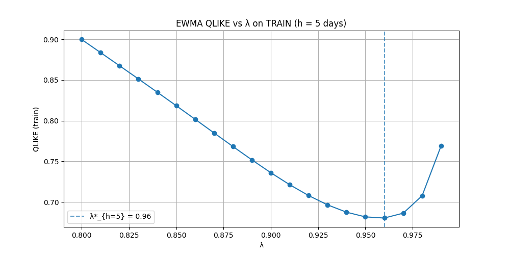 | 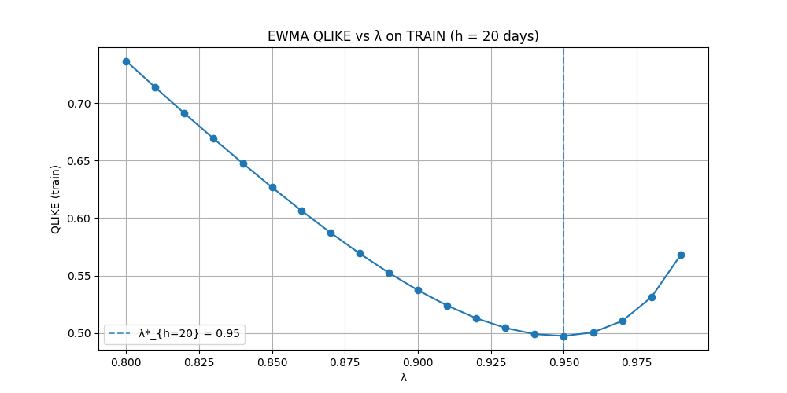 | 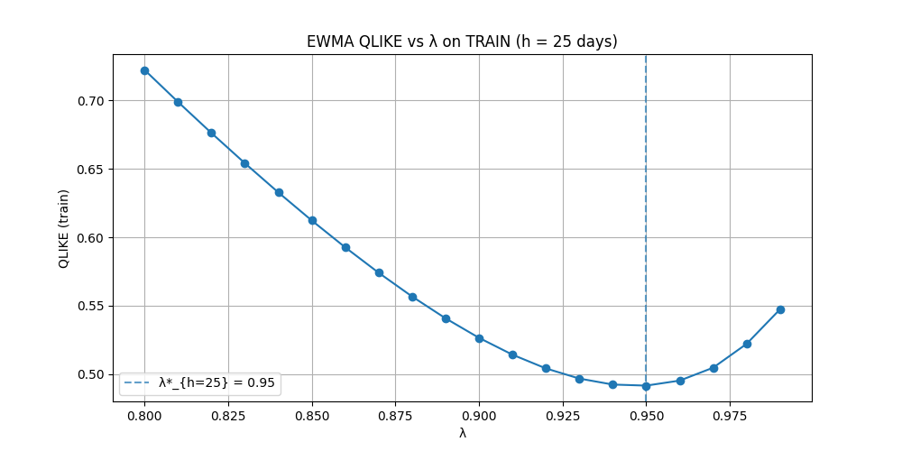 |

The optimal values based on training QLIKE minimisation were:

| Horizon | Optimal Lambda |
|---------|---------------|
| 5-day | 0.96 |
| 20-day | 0.95 |
| 25-day | 0.95 |

### 2. GARCH

Generalised Autoregressive Conditional Heteroskedasticity (GARCH) is a statistical model used to estimate the volatility of financial returns by assuming that current variance depends on past variance and past shocks. Unlike EWMA which simply assign exponentially decreasing weights to past observations, GARCH captures "volatility clustering," where periods of high turbulence tend to follow one another, making it widely used in practice.

The GARCH(1,1) model assumes that current variance depends on past return residuals lagged by t-1 and past variance lagged by t-1. Conditional variance in this model is specified as:

$$\sigma^2_t = \omega + \alpha \varepsilon^2_{t-1} + \beta \sigma^2_{t-1}$$

where:
- $\omega > 0$ is the constant term (baseline variance)
- $\alpha \geq 0$ is the ARCH coefficient (reaction to recent shocks)
- $\beta \geq 0$ is the GARCH coefficient (persistence)
- $\varepsilon_{t-1} = r_{t-1} - \mu$ is the return residual

The unconditional (long-run) variance can be calculated in the following way:

$$\sigma^2_{LR} = \frac{\omega}{1 - \alpha - \beta}$$

which requires $\alpha + \beta < 1$ for stationarity (we enforce this constraints when calculating the maximum likelihood estimators of the parameters of the model).

Given we are dealing with equity markets, we also include the GJR-GARCH model ([Glosten, Jagannathan, and Runkle, 1993](https://onlinelibrary.wiley.com/doi/10.1111/j.1540-6261.1993.tb05127.x)) which adds an additional term with a coefficient to capture the "leverage effect" (i.e. the asymmetry where negative returns increase volatility more than positive returns of equal magnitude).

In the GJR-GARCH(1,1) specification we again assume that current variance depends on the three parameters lagged by 1 time period:

$$\sigma^2_t = \omega + \alpha \varepsilon^2_{t-1} + \gamma \varepsilon^2_{t-1} \mathbf{1}\_{[\varepsilon_{t-1} < 0]} + \beta \sigma^2_{t-1}$$

where:
- $\gamma \geq 0$ is the leverage coefficient
- $\mathbf{1}\_{[\varepsilon_{t-1} < 0]}$ is an indicator function equal to 1 when $\varepsilon_{t-1} < 0$ (gamma influences the model only when returns are negative)

As seen above, the total impact of negative shocks is $(\alpha + \gamma)$, while positive shocks contribute only $\alpha$ [Engle and Ng (1993)](https://onlinelibrary.wiley.com/doi/10.1111/j.1540-6261.1993.tb05127.x).

#### GARCH and GJR-GARCH Selection Methodology

When selecting the right specification of our GARCH model we employ a different method compared to EWMA. Indeed, GARCH parameters are determined by solving an optimisation problem through which we obtain the maximum likelihood estimates of the model parameters. Although [Hansen and Lunde (2005)](https://onlinelibrary.wiley.com/doi/full/10.1002/jae.800) found no evidence "that the GARCH(1,1) model is significantly outperformed by more sophisticated models in out-of-sample forecasting." in their 330 ARCH-type model comparison, we decide to follow standard practice to select our GARCH specification. Indeed, as per ([Tsay, 2005, pp. 41-43](https://pzs.dstu.dp.ua/DataMining/times/bibl/Tsay.pdf)), we use information criteria to select among GARCH specifications:

**Akaike Information Criterion (AIC)**:
$$\text{AIC} = 2k - 2\ln(\hat{L})$$

**Bayesian Information Criterion (BIC)**:
$$\text{BIC} = k\ln(n) - 2\ln(\hat{L})$$

where:
- $k$ is the number of parameters
- $\hat{L}$ is the maximised likelihood
- $n$ is the sample size

We focus on BIC which penalises model complexity more heavily than AIC, typically favouring more parsimonious specifications less prone to overfitting.

#### GARCH and GJR-GARCH Selection Results

We estimated all combinations of GARCH(p,q) and GJR-GARCH(p,o,q) for $p, q, o \in \{1, 2, 3, 4, 5\}$ on the combined in-sample and validation data (2015-2021). We report the two highest ranked models according to the two information criteria metrics (although we choose the models based on BIC):

| Rank | Model | AIC | BIC |
|------|-------|-----|-----|
| 1 (AIC) | GJR-GARCH(5,5,1) | 6332.23 | 6403.39 |
| 1 (BIC) | GJR-GARCH(1,1,1) | 6358.02 | **6385.39** |
| 2 (AIC) | GJR-GARCH(5,5,5) | 6334.15 | 6427.21 |
| 2 (BIC) | GARCH(1,1) | 6366.19 | **6388.08** |

By focusing on the BIC metric, which follows the parsimony principle emphasised by [Hansen and Lunde (2005)](https://onlinelibrary.wiley.com/doi/full/10.1002/jae.800), we selected **GJR-GARCH(1,1)** as our primary specification while keeping **GARCH(1,1)** as a reference benchmark. We note that higher-order models tend to overfit in-sample data, thus, potentially underperforming on out-of-sample data.

### 3. LSTM

We read many papers in the LSTM volatility forecasting literature, however, we did not find a unified way to determine the target, architecture or feature set to apply. Thus, we decided to take two main approaches. First, we implemented a pure LSTM which forecasts realised volatility. Secondly, we implemented a GARCH-LSTM hybrid where the LSTM's prediction task is to predict how wrong the GARCH model is going to be and fix its prediction. Further, regarding architecture and features, we take inspiration from the literature and conduct in-sample testing (train/validation) as well.

Here are some of the LSTM approaches we inspired our methodology from:
- [Kim and Won (2018)](https://www.sciencedirect.com/science/article/abs/pii/S0957417418301416), who achieved improvements over traditional models using hybrid architectures.
- [Kakade et al. (2021)](https://papers.ssrn.com/sol3/papers.cfm?abstract_id=3992382)
- [Roszyk and Slepaczuk (2024)](https://arxiv.org/html/2407.16780v1)

**Key Note: Whilst in literature it is common to add external data to the LSTM (such as VIX, etc.), one of our key choices is to create features solely from the return time series. The goal of this is to compare EWMA, GARCH, and LSTMs more on a like-for-like basis. We expect the LSTM approach to be able to consistently outperform GARCH if we were able to include external data**

#### LSTM Architecture and Hyperparameters

We tuned our LSTMs based on the literature parameters rather than exhaustive (and computationally expensive) grid search:

| Parameter | Value | Justification |
|-----------|-------|--------|
| Lookback window | 22 days | [Roszyk and Slepaczuk (2024)](https://arxiv.org/html/2407.16780v1) |
| LSTM units | 128 | [Roszyk and Slepaczuk (2024)](https://arxiv.org/html/2407.16780v1) |
| LSTM layers | 1 | Models performed better when conducting tests on in-sample data |
| Dropout rate | 0.2 | [Srivastava et al. (2014)](https://jmlr.org/papers/v15/srivastava14a.html) |
| Dense hidden units | 128 | Models performed better when conducting tests on in-sample data |
| Dense hidden layers | 1 | Models performed better when conducting tests on in-sample data |
| Epochs | 50 (with early stopping based on validation set) | Models performed better when conducting tests on in-sample data |
| Batch size | 64 | Models performed better when conducting tests on in-sample data |
| Activation function | tanh | [Roszyk and Slepaczuk (2024)](https://arxiv.org/html/2407.16780v1) |
| Validation Set Early Stop | 80/20 split on the training set | Models performed better when conducting tests on in-sample data |

#### Pure LSTM

Our forward-looking pure LSTM directly predicts future realised variance over different horizons as a target:

**Features** (all backward-looking, available at time $t$):
- Lagged returns (last 5 days, for recent shocks): $r_{t-1}, r_{t-2}, \ldots, r_{t-5}$
- Lagged squared returns (arch effect): $r^2_{t-1}, r^2_{t-2}, \ldots, r^2_{t-5}$
- Rolling volatilities at windows of 5, 10, and 20 days
- Rolling variances at windows of 5, 10, and 20 days

**Target**:
$$\sigma^2_{\text{target},t} = \frac{1}{h}\sum_{i=1}^{h} r^2_{t+i}$$

where $h$ is the forecast horizon (5, 20, or 25 days).

#### Hybrid GARCH-LSTM

We implement a hybrid GARCH-LSTM model where the LSTM learns to adjust the baseline forecast from a GJR-GARCH(1,1) model. Inspired by the idea that predicting the forecasting error of an econometric model may be an easier task than directly predicting volatility, our LSTM estimates a multiplicative correction factor to scale GJR-GARCH forecasts. This setup draws from [Hu, Ni, and Wen (2020)](https://www.sciencedirect.com/science/article/pii/S0378437120304696)'s work, as they demonstrated that GARCH forecasts can serve as informative features to increase LSTM predictive power.

**Features**:
- Same features as the Pure LSTM
- GJR-GARCH forecasts

**Target**:
$$\rho_t = \frac{\sigma^2_{\text{realised},t}}{\hat{\sigma}^2_{\text{GJR},t}}$$

i.e. the LSTM predicts the adjustment ratio needed to "fix" GJR-GARCH's forecast.

**Final Forecast**:
$$\hat{\sigma}^2_{\text{hybrid},t} = \hat{\sigma}^2_{\text{GJR},t} \times \hat{\rho}_{\text{LSTM},t}$$

where $\hat{\rho}_{\text{LSTM},t}$ is the model’s predicted correction factor.

## Results

### Out-of-Sample Performance Summary

| Horizon | EWMA | GARCH | GJR-GARCH | Best |
|:---|:---:|:---:|:---:|:---:|
| 5-day | 0.4222 | 0.4251 | **0.3969** | GJR-GARCH |
| 20-day | 0.2049 | 0.1903 | **0.1529** | GJR-GARCH |
| 25-day | 0.1866 | 0.1723 | **0.1332** | GJR-GARCH |

*Lower QLIKE values indicate better performance.*

GJR-GARCH(1,1) consistently outperforms both EWMA and standard GARCH(1,1) across all forecast horizons, confirming the importance of capturing leverage effects in equity volatility.

### LSTM Performance

#### Pure LSTM

| Horizon | EWMA | GARCH | GJR-GARCH | LSTM (Pure) | Best |
|:---|:---:|:---:|:---:|:---:|:---:|
| 5-day | 0.4222 | 0.4251 | **0.3969** | 0.5828 | GJR-GARCH |
| 20-day | 0.2049 | 0.1903 | **0.1529** | 0.2494 | GJR-GARCH |
| 25-day | 0.1866 | 0.1723 | **0.1332** | 0.2050 | GJR-GARCH |

Generally, the Pure LSTM model performs worse than all other models with the 5-day window displaying a significantly worse performance in absolute terms.

#### Hybrid GARCH-LSTM

| Horizon | EWMA | GARCH | GJR-GARCH | LSTM Hybrid | Best |
|:---|:---:|:---:|:---:|:---:|:---:|
| 5-day | 0.4222 | 0.4251 | **0.3969** | 0.5906 | GJR-GARCH |
| 20-day | 0.2049 | 0.1903 | **0.1529** | 0.2638 | GJR-GARCH |
| 25-day | 0.1866 | 0.1723 | **0.1332** | 0.2079 | GJR-GARCH |

Similarly to the Pure LSTM model, the Hybrid GARCH-LSTM model performs worse than all other models, however, it has a very similar performance to the Pure LSTM model on the 25-day window.

### Comparative Performance Table

| Horizon | EWMA | GARCH | LSTM (Pure) | LSTM Hybrid | vs. |
|:---|:---:|:---:|:---:|:---:|:---:|
| 5-day | 0.06 | 0.07 | 0.47 | 0.49 | GJR-GARCH |
| 20-day | 0.34 | 0.25 | 0.63 | 0.73 | GJR-GARCH |
| 25-day | 0.40 | 0.30 | 0.54 | 0.56 | GJR-GARCH |

### Plotted Forecasts by chosen Horizon

#### 5-Day Horizon

| Model | Plot |
|:-------------:|:--------------:|
| **EWMA** | 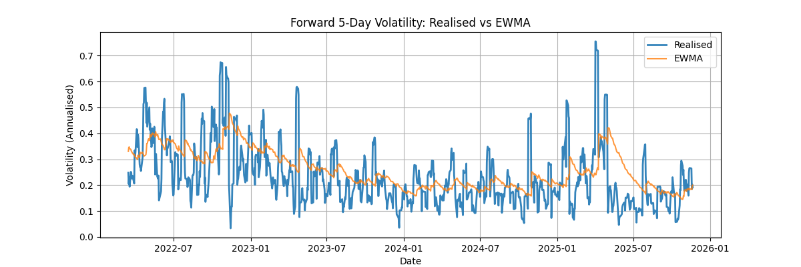 |
| **GARCH(1,1)** | 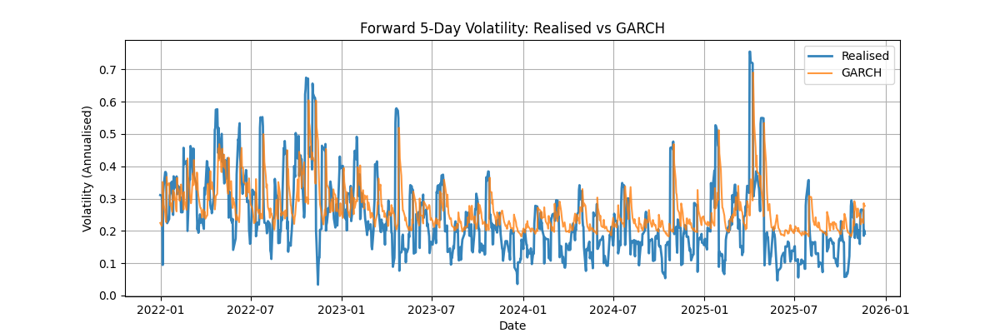 |
| **GJR-GARCH(1,1,1)** | 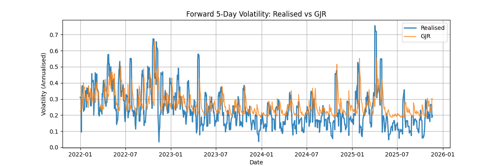 |
| **Pure LSTM** | 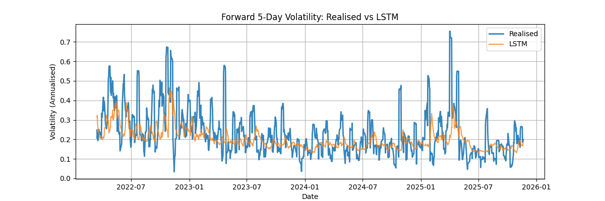 |
| **Hybrid GARCH-LSTM** | 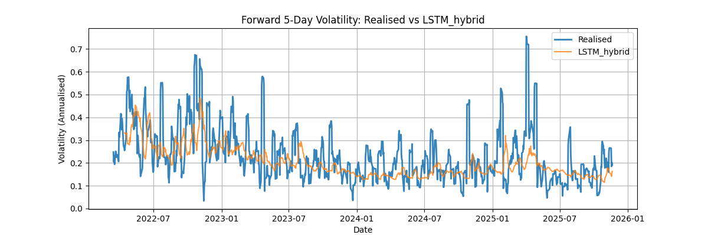 |

#### 20-Day Horizon

| Model | Plot |
|:-------------:|:--------------:|
| **EWMA** | 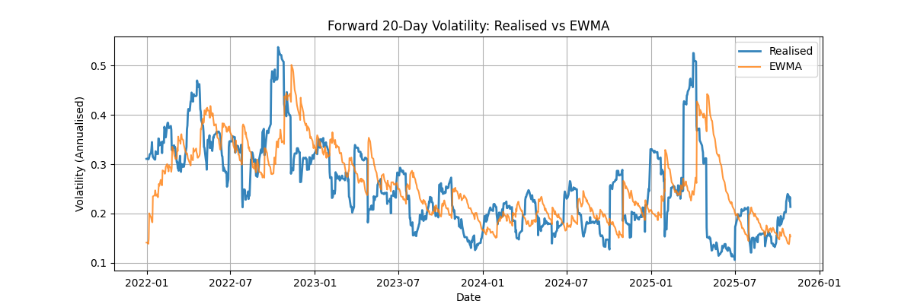 |
| **GARCH(1,1)** | 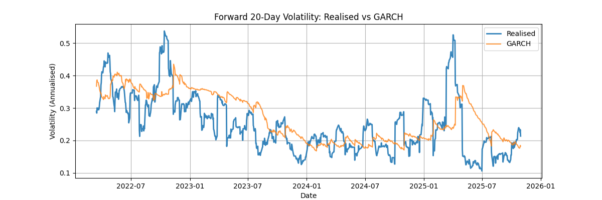 |
| **GJR-GARCH(1,1,1)** | 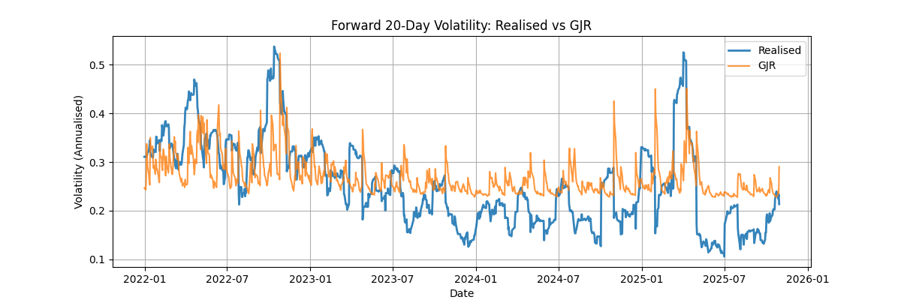 |
| **Pure LSTM** | 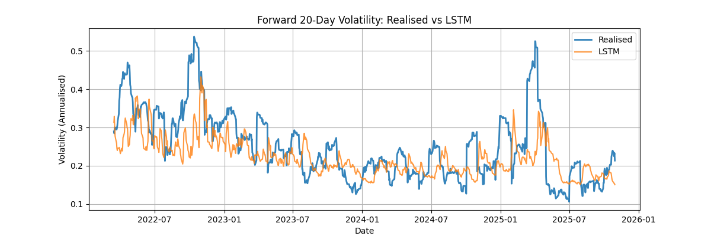 |
| **Hybrid GARCH-LSTM** | 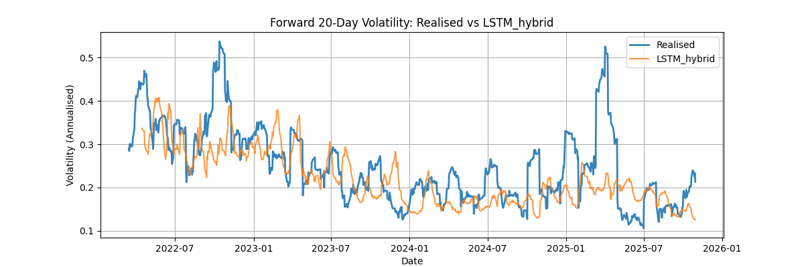 |

#### 25-Day Horizon

| Model | Plot |
|:-------------:|:--------------:|
| **EWMA** | 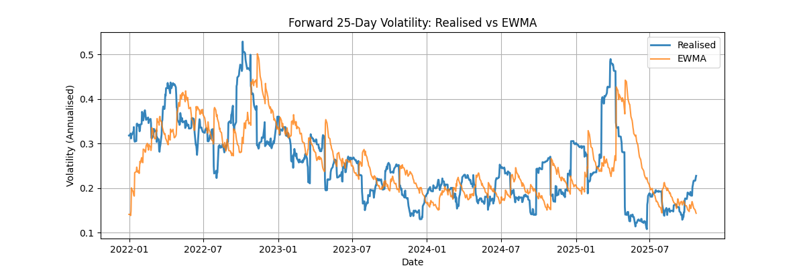 |
| **GARCH(1,1)** | 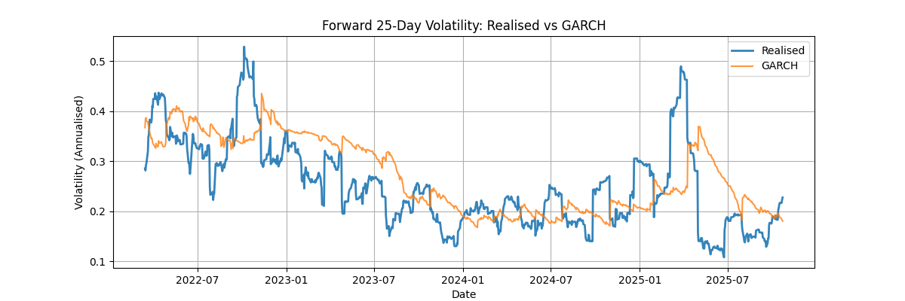 |
| **GJR-GARCH(1,1,1)** | 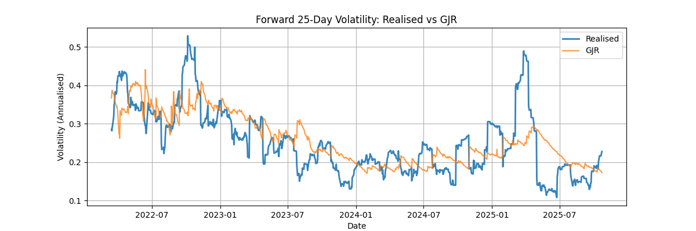 |
| **Pure LSTM** | 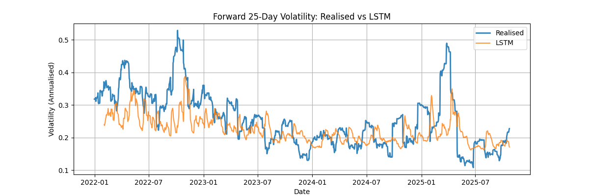 |
| **Hybrid GARCH-LSTM** | 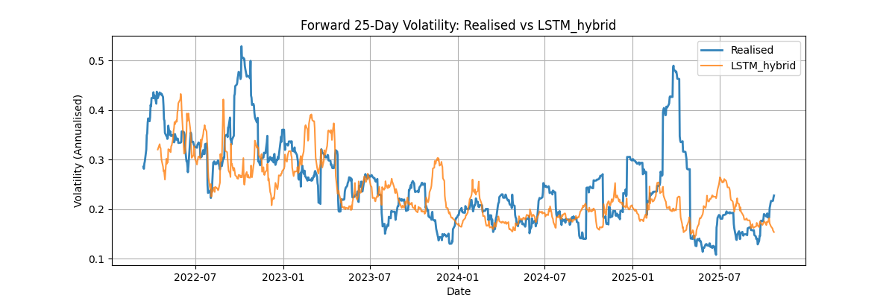 |

### Key Observations

1. **GJR-GARCH dominates across all horizons and comparisons**: The leverage effect captured by the asymmetric term provides consistent forecasting improvements.

2. **LSTM underperforms traditional models**: Both the LSTM and hybrid LSTM architectures fail to outperform GJR-GARCH(1,1,1). This is particularly evident at the 20-day horizon, where, in relative terms, the LSTM and Hybrid LSTM QLIKE (0.25, 0.26) is substantially worse than GJR-GARCH (0.15).

3. **Hybrid approach does not improve upon GJR-GARCH**: Despite incorporating GJR-GARCH forecasts as features, the LSTM adjustment mechanism degrades rather than improves performance.

4. **Performance gap is narrowest for short horizons**: While GJR-GARCH remains superior, the LSTM models show  better (though still inferior) relative performance at a 5-day horizon compared to their 20-day and 25-day horizons relative performance (with the 25-day window being the second best in terms of relative performance).

5. **Hybrid approach seems to perform in line with the Pure LSTM at 5- and 25-day horizons**: While the Pure LSTM approach performs better than the Hybrid approach at all horizons, the performance gap is much less significant at 5- and 25-day windows.    

## Conclusion

This study provides evidence that for daily equity volatility forecasting, parsimonious GARCH-family models—specifically GJR-GARCH(1,1,1) outperform more complex LSTM neural network architectures when fed with the same time series as inputs. This finding aligns with the conclusions of [Hansen and Lunde (2005)](https://onlinelibrary.wiley.com/doi/full/10.1002/jae.800), who found that simple GARCH(1,1) is difficult to beat in out-of-sample forecasting.

We note that, we do not consider the negative LSTM results as evidence of fundamental limitations of deep learning models for volatility forecasting, indeed, these results reveal several key considerations:

1. **Noise**: Daily returns contain substantial noise, and the relatively small sample size (approximately 2,700 observations) may be insufficient for LSTM to learn robust patterns beyond what GARCH already captures.

2. **Feature engineering**: As mentioned, the features used were derived exclusively from the price data which means they are highly correlated and may not provide information beyond what is already present in the GARCH structure. Indeed, using only returns as a basis for features significantly limits the capabilities of the LSTM which could take many other features as inputs(such as volume, sentiment, VIX, etc.). However, this would have made a comparison to econometric models more difficult.  

3. **Evaluation methodology**: Using averaged squared daily returns as a volatility proxy introduces measurement error that may disadvantage models attempting to capture more subtle patterns.

### Limitations and Future Work

1. **Realised Volatility**: This study uses squared daily returns as a volatility proxy. Future work should incorporate high-frequency intraday data to construct better realised volatility measures, which [Andersen and Bollerslev (1998)](https://www.jstor.org/stable/2527343) showed can dramatically improve model evaluation.

2. **Multi-Asset Analysis**: Results are based on a single equity (MSFT). Robustness should be tested across multiple assets, sectors, and asset classes.

3. **Alternative Architectures**: Other neural network architectures may be more suitable for volatility forecasting:
   - Transformer-based models with attention mechanisms have recently been successfully applied to volatility forcasting by [Soroka and Arzyn (2025)](https://arxiv.org/abs/2511.03046).

4. **Regime-Dependent Models**: The test period (2022-2025) includes both high-volatility (post-COVID, 2022 bear market) and low-volatility regimes. Regime-switching models or separate LSTM training by volatility regime may improve performance.

5. **Longer Training Periods**: Deep learning models typically benefit from larger datasets, thus, extending the training period or incorporating multiple assets (or a higher frequency, as mentioned) may allow LSTM to learn more generalizable patterns.

---

## License

MIT License
